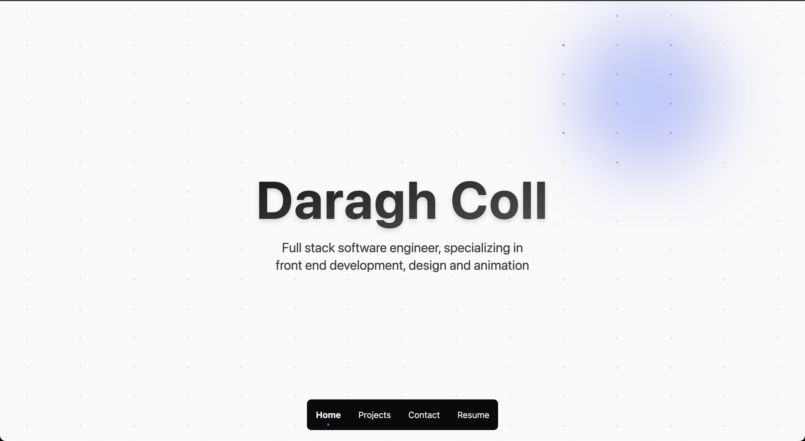

This is the source code for my personal website, built with React, TypeScript, Vite, and Tailwind CSS.

## Features

- Modern, responsive design
- Built with React and TypeScript
- Styled using Tailwind CSS
- Modular component structure
- Easy to customize and extend

## Getting Started

### Running the Development Server

```sh
npm run dev
```

The site will be available at `http://localhost:5173` by default.

### Building for Production

```sh
npm run build
```

### Previewing the Production Build

```sh
npm run preview
```

## Project Structure

- `src/` - Main source code
  - `components/` - React components
  - `assets/` - Static assets (images, SVGs, etc.)
- `public/` - Public static files
- `index.html` - Main HTML file
- `vite.config.ts` - Vite configuration
- `tailwind.config.js` - Tailwind CSS configuration

## License

This project is open source and available under the [MIT License](LICENSE).
